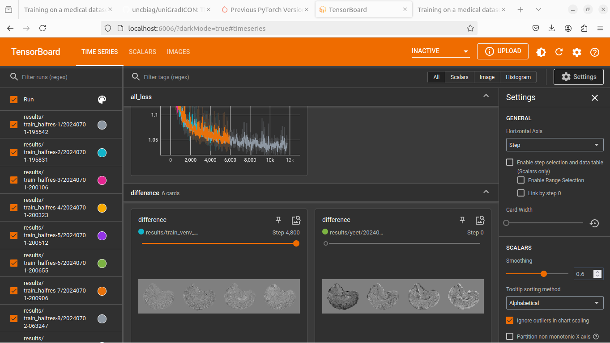

Training on a medical dataset
^^^^^^^^^^^^^^^^^^^^^^^^^^^^^

While we can learn to register 2-D images in a few minutes even on cpu, training for registering 3-D volumes is a more serious endeavor, especially at high resolutions. For that reason, we recommend: 

- Preprocessing all your data in a seperate script and storing it as a :func:`torch.load` / :func:`torch.save` file. This makes loading your dataset fast for iterating changes to your training script, but also prevents you from being bottlenecked by the disk during training.

- Recording all hyperparameters assosciated with each training run so that you can replicate it- this is super important if you are investing hours or days into a training run, and super easy with :mod:`footsteps`

- Generating and saving metrics, visualizations and weight checkpoints throughout training.

If you have not already, create and activate a virtual environment, and install :mod:`icon_registration`

.. code-block:: bash
       
       python3 -m venv venv
       source venv/bin/activate
       pip install icon_registration

       mkdir LUMIR_tutorial
       cd LUMIR_tutorial
       git init

Chosing and Downloading a dataset
=================================

For this tutorial we will use the LUMIR dataset and evaluation provided by Learn2Reg 2024. Information on the LUMIR task is hosted on `github <https://github.com/JHU-MedImage-Reg/LUMIR_L2R/>`_. To begin, download and unzip the LUMIR data from `Google Drive <https://drive.usercontent.google.com/download?id=1PTHAX9hZX7HBXXUGVvI1ar1LUf4aVbq9&export=download&authuser=0>`_

.. code-block:: bash

        > ls
        LUMIR_L2R24_TrainVal.zip
        > unzip LUMIR_L2R24_TrainVal.zip
        ...
        > ls
        LUMIR_L2R24_TrainVal.zip  imagesTr imagesVal
        
Selecting a Model
=================

This tutorial can be used to train the architectures GradICON or Inverse Consistency by Construction, or to finetune uniGradICON. The following code is very similar to the code used to train the 2-D model for registering the MNIST test dataset, but with dimension set to 3. This is also the stage to select the resolution that your model runs at. For this dataset, we will pick half of the original resolution for ConstrICON or GradICON, and for uniGradICON we will pick [175, 175, 175] to match the pretrained weights.

Create model.py as follows:

.. tabs::

   .. code-tab:: python GradICON

      # model.py

      import icon_registration as icon

      input_shape = [1, 1, 96, 112, 80]

      def make_network(): 
        inner_net = icon.FunctionFromVectorField(networks.tallUNet2(dimension=3))
  
        for _ in range(3):
             inner_net = icon.TwoStepRegistration(
                 icon.DownsampleRegistration(inner_net, dimension=3),
                 icon.FunctionFromVectorField(networks.tallUNet2(dimension=3))
             )
  
        net = icon.GradientICON(inner_net, icon.LNCC(sigma=4), lmbda=.5)
        net.assign_identity_map(input_shape)
        return net
   
   .. code-tab:: python ConstrICON

      # model.py

      import icon_registration.constricon as constricon

      input_shape = [1, 1, 96, 112, 80]

      def make_network():
        net = constricon.FirstTransform(
          constricon.TwoStepInverseConsistent(
              constricon.ConsistentFromMatrix(
                networks.ConvolutionalMatrixNet(dimension=3)
            ),
            constricon.TwoStepInverseConsistent(
                constricon.ConsistentFromMatrix(
                    networks.ConvolutionalMatrixNet(dimension=3)
                ),
                constricon.TwoStepInverseConsistent(
                    constricon.ICONSquaringVelocityField(
                        networks.tallUNet2(dimension=3)
                    ),
                    constricon.ICONSquaringVelocityField(
                        networks.tallUNet2(dimension=3)
                    ),
                ),
            ),
          )
        )
      net = constricon.VelocityFieldDiffusion(net, icon.LNCC(5), lmbda)
      net.assign_identity_map(input_shape)
      return net

   .. code-tab:: python uniGradICON

      # model.py

      import unigradicon

      input_shape = [1, 1, 175, 175, 175]

      def make_network():

          return unigradicon.get_unigradicon()
       

Preprocessing the Dataset
=========================

Next, convert the data into a pytorch tensor that can be quickly loaded. This is also where we would handle resampling all our images to 
the same resolution if they were heterogeneous resolutions or downsampling if the data were higher resolution than we wanted. We will initially train at half the LUMIR resolution.

.. code-block:: python

        #preprocess_lumir.py
   
        import footsteps
        import torch
        import itk
        import tqdm
        import numpy as np
        import glob
        import torch.nn.functional as F

        from model import input_shape

        footsteps.initialize()

        image_paths = glob.glob("imagesTr/LUMIRMRI_*_*.nii.gz") #

        ds = []

        def process(image):
            image = image[None, None] # add batch and channel dimensions

            #image = torch.nn.functional.avg_pool3d(image, 2)
            image = F.interpolate(image, input_shape[2:], mode="trilinear") 

            return image

        for name in tqdm.tqdm(list(iter(image_paths))[:]):

            image = torch.tensor(np.asarray(itk.imread(name)))

            ds.append(process(image))

        torch.save(ds, f"{footsteps.output_dir}/training_data.trch")

This is the script that you most likely need to modify for new datasets. For LUMIR, this takes around 20 mins to an hour to run, but means in all subsequent runs we can start training after a few seconds. If your dataset does not fit in RAM (we use a lot of RAM) then this script will need to be modified to stream from disk. (Some would argue more RAM is cheaper than developer time.)

.. code-block:: bash

        > python preprocess_lumir.py 
        Input name of experiment:
        preprocessed_data
        Saving results to results/preprocessed_data/

Training the Model
==================

Once the data is preprocessed, we train a network to register it. In this example we are doing inter-subject brain registration, so we can just compile batches by sampling random pairs from the dataset.

.. code-block:: python

        # train.py

        import random

        import footsteps
        import icon_registration as icon
        import icon_registration.networks as networks
        import torch

        from model import input_shape, make_network

We define a custom function for creating and preparing batches of images. Feel free to do this with a torch :class:`torch.Dataset`, but I am more confident about predicting the performance of procedural code for this task.

.. code-block:: python

        BATCH_SIZE = 8
        GPUS = 4

        def make_batch():
            image = torch.cat([random.choice(brains) for _ in range(GPUS * BATCH_SIZE)])
            image = image.cuda()
            image = image / torch.max(image)
            return image.float()

Then, use the function :func:`icon_registration.train.train_batchfunction` to commence training.

.. code-block:: python

        if __name__ == "__main__":
            footsteps.initialize()
            brains = torch.load(
                "results/preprocessed_data/training_data.trch"
            )
            net = make_network()

            if GPUS == 1:
                net_par = net.cuda()
            else:
                net_par = torch.nn.DataParallel(net).cuda()
            optimizer = torch.optim.Adam(net_par.parameters(), lr=0.00005)

            net_par.train()

            icon.train_batchfunction(net_par, optimizer, lambda: (make_batch(), make_batch()), unwrapped_net=net)

.. code-block:: bash
       
       > python train.py
       Input name of experiment: 
       train_halfres
       Saving results to results/train_halfres-4

During training, a tensorboard log is created. To view this, in another window, with the virtual environment activated, run 

.. code-block:: bash

       > tensorboard --logdir .

Tensorboard will the be viewable in the browser in port 6006.

Evaluation and deployment
=========================

What we have now is a trained model that operates at resolution [96, 112, 80] which we want to evaluate on labelmaps and images of resolution [192, 224, 160]. This is the common case- most deep registration algorithms do not run at the original data resolution. Handling details of transform and image orientation, resolution and spacing is a sufficiently complex topic that we use an external library dedicated to this: ITK. First, we write a command line script to use our pretrained model to register a pair and write a transform. Be sure to modify the weights location based on which training run you want to use, and how far it has progressed.

.. code-block:: python

        # register_pair.py

	import argparse
	import itk
	import model
	import icon_registration.register_pair
	import icon_registration.config

	def get_model():
	    net = model.make_network()
	    # modify weights_location based on the training run you want to use
	    weights_location = "results/train_halfres/network_weights_49800"
	    trained_weights = torch.load(weights_location, map_location=torch.device("cpu"))
	    net.regis_net.load_state_dict(trained_weights)
	    net.to(icon_registration.config.device)

	def preprocess(image):
	    # If you change the _intensity_ preprocessing in preprocess_lumir.py or make_batch(), 
	    # make a corresponding change here.

	    image = itk.CastImageFilter[type(image), itk.Image[itk.F, 3]].New()(image)
	    _, max_ = itk.image_intensity_min_max(image)

	    image = itk.shift_scale_image_filter(image, shift=0, scale = 1/(max_)) 
	    return image

	if __name__ == "__main__":
	    parser = argparse.ArgumentParser(description="Register two images using unigradicon.")
	    parser.add_argument("--fixed", required=True, type=str,
				 help="The path of the fixed image.")
	    parser.add_argument("--moving", required=True, type=str,
				 help="The path of the fixed image.")
	    parser.add_argument("--transform_out", required=True,
				 type=str, help="The path to save the transform.")
	    parser.add_argument("--warped_moving_out", required=False,
				default=None, type=str, help="The path to save the warped image.")
	    parser.add_argument("--io_iterations", required=False,
				 default="50", help="The number of IO iterations. Default is 50. Set to 'None' to disable IO.")

	    args = parser.parse_args()

	    net = get_model()

	    fixed = itk.imread(args.fixed)
	    moving = itk.imread(args.moving)

	    if args.io_iterations == "None":
		io_iterations = None
	    else:
		io_iterations = int(args.io_iterations)

	    phi_AB, phi_BA = icon_registration.itk_wrapper.register_pair(
		net,
		preprocess(moving), 
		preprocess(fixed), 
		finetune_steps=io_iterations)

	    itk.transformwrite([phi_AB], args.transform_out)

	    if args.warped_moving_out:
		moving = itk.CastImageFilter[type(moving), itk.Image[itk.F, 3]].New()(moving)
		interpolator = itk.LinearInterpolateImageFunction.New(moving)
		warped_moving_image = itk.resample_image_filter(
			moving,
			transform=phi_AB,
			interpolator=interpolator,
			use_reference_image=True,
			reference_image=fixed
			)
		itk.imwrite(warped_moving_image, args.warped_moving_out)

Now, we are able to register images.

.. code-block:: bash

       python register_pair.py --fixed fixed.nrrd --moving moving.nrrd --transform_out transform.hdf5 --warped_moving_out warped.nrrd

The warped image warped.nrrd and transform transform.hdf5 can be viewed and further used (e.g. to warp a segmentation) using medical imaging software such as 3-D Slicer. (https://www.slicer.org/) 
