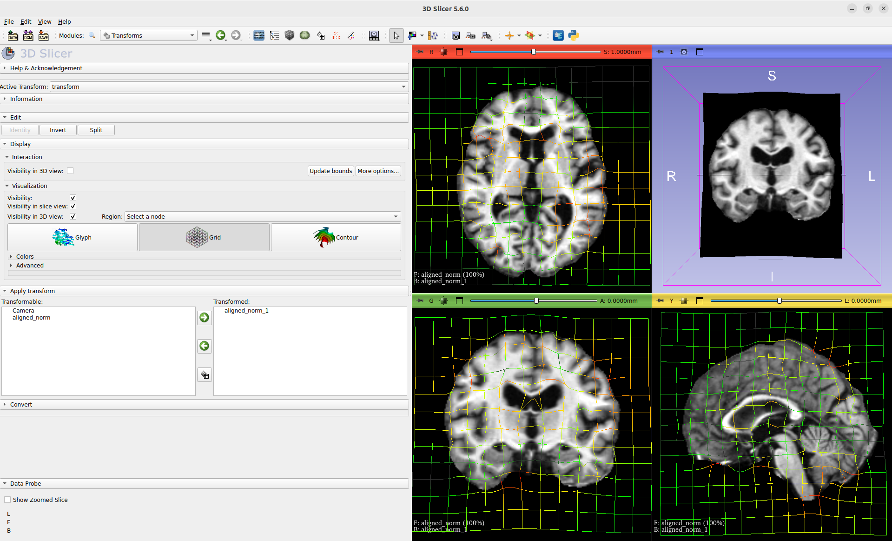

Training on a medical dataset
^^^^^^^^^^^^^^^^^^^^^^^^^^^^^

While we can learn to register 2-D images in a few minutes even on cpu, training for registering 3-D volumes is a more serious endeavor, especially at high resolutions. For that reason, we recommend: 

- Preprocessing all your data in a seperate script and storing it as a :func:`torch.load` / :func:`torch.save` file. This makes loading your dataset fast for iterating changes to your training script, but also prevents you from being bottlenecked by the disk during training.

- Recording all hyperparameters assosciated with each training run so that you can replicate it- this is super important if you are investing hours or days into a training run, and super easy with :mod:`footsteps`

- Generating and saving metrics, visualizations and weight checkpoints throughout training.

If you have not already, create and activate a virtual environment, and install :mod:`icon_registration`

.. tabs::

   .. code-tab:: bash venv
       
       python3 -m venv venv
       source venv/bin/activate
       pip install icon_registration unigradicon

       mkdir OASIS_tutorial
       cd OASIS_tutorial
       git init

   .. code-tab:: bash conda
       
       conda create -n iconregistration python==3.10
       conda activate iconregistration
       pip install icon_registration unigradicon

       mkdir OASIS_tutorial
       cd OASIS_tutorial
       git init

Chosing and Downloading a dataset
=================================

For this tutorial we will use the `OASIS dataset <https://sites.wustl.edu/oasisbrains/#data>`_ and evaluation provided by Learn2Reg 2021. Information on the OASIS task, and the data download, are hosted on https://learn2reg.grand-challenge.org/Learn2Reg2021/. To begin, download and unzip the OASIS data.

.. code-block:: bash

        > wget https://surfer.nmr.mgh.harvard.edu/ftp/data/neurite/data/neurite-oasis.v1.0.tar
        > ls
        neurite-oasis.v1.0.tar
        > mkdir OASIS
        > cd OASIS
        > tar -xf ../neurite-oasis.v1.0.tar
        ...
        > cd ..
        > ls OASIS/
        OASIS_OAS1_0001_MR1 OASIS_OAS1_0002_MR1 ... 
        
Selecting a Model
=================

This tutorial can be used to train the architectures GradICON or Inverse Consistency by Construction, or to finetune uniGradICON. The following code is very similar to the code used to train the 2-D model for registering the MNIST test dataset, but with dimension set to 3. This is also the stage to select the resolution that your model runs at. For this tutorial, to facilitate fast training from scratch, we will pick [128, 128, 128] for ConstrICON or GradICON, and for uniGradICON we will pick [175, 175, 175] to match the pretrained weights.

Create model.py as follows:

.. tabs::

   .. code-tab:: python GradICON

      # model.py

      import icon_registration as icon
      from icon_registration import networks

      input_shape = [1, 1, 128, 128, 128]

      def make_network(): 
        inner_net = icon.FunctionFromVectorField(networks.tallUNet2(dimension=3))
  
        for _ in range(2):
             inner_net = icon.TwoStepRegistration(
                 icon.DownsampleRegistration(inner_net, dimension=3),
                 icon.FunctionFromVectorField(networks.tallUNet2(dimension=3))
             )
        inner_net = icon.TwoStepRegistration(
                 inner_net,
                 icon.FunctionFromVectorField(networks.tallUNet2(dimension=3))
             )
  
        net = icon.GradientICON(inner_net, icon.LNCC(sigma=4), lmbda=1.5)
        net.assign_identity_map(input_shape)
        return net
   
   .. code-tab:: python ConstrICON

      # model.py

      import icon_registration.constricon as constricon

      input_shape = [1, 1, 128, 128, 128]

      def make_network():
        net = constricon.FirstTransform(
          constricon.TwoStepInverseConsistent(
              constricon.ConsistentFromMatrix(
                networks.ConvolutionalMatrixNet(dimension=3)
            ),
            constricon.TwoStepInverseConsistent(
                constricon.ConsistentFromMatrix(
                    networks.ConvolutionalMatrixNet(dimension=3)
                ),
                constricon.TwoStepInverseConsistent(
                    constricon.ICONSquaringVelocityField(
                        networks.tallUNet2(dimension=3)
                    ),
                    constricon.ICONSquaringVelocityField(
                        networks.tallUNet2(dimension=3)
                    ),
                ),
            ),
          )
        )
      net = constricon.VelocityFieldDiffusion(net, icon.LNCC(5), lmbda)
      net.assign_identity_map(input_shape)
      return net

   .. code-tab:: python uniGradICON

      # model.py

      import unigradicon

      input_shape = [1, 1, 175, 175, 175]

      def make_network():

          return unigradicon.get_unigradicon()
       

Preprocessing the Dataset
=========================

Next, convert the data into a pytorch tensor that can be quickly loaded. This is also where we handle resampling all our images to the same resolution if they were heterogeneous resolutions or downsampling if the data were higher resolution than we wanted. For this tutorial, we train at a lower than original resolution, as chosen in model.py . Once you have completed this tutorial, if you are training GradICON on your own dataset, you can choose to retrain with input_shape to your data's native resolution to get a more performant model at the cost of longer training.

.. code-block:: python

        #preprocess_oasis.py
   
        import footsteps
        import torch
        import itk
        import tqdm
        import numpy as np
        import glob
        import torch.nn.functional as F

        from model import input_shape

        footsteps.initialize()

        image_paths = glob.glob("OASIS/*/aligned_norm.nii.gz") #

        ds = []

        def process(image):
            image = image[None, None] # add batch and channel dimensions

            image = F.interpolate(image, input_shape[2:], mode="trilinear") 

            return image

        for name in tqdm.tqdm(list(iter(image_paths))[:]):

            image = torch.tensor(np.asarray(itk.imread(name)))

            ds.append(process(image))

        torch.save(ds, f"{footsteps.output_dir}/training_data.trch")

This is the script that you most likely need to modify for new datasets. For OASIS, this takes around 5 minutes to run, but means in all subsequent runs we can start training after a few seconds. If your dataset does not fit in RAM  then this script will need to be modified to stream from disk.

.. code-block:: bash

        > echo "preprocessed_data" | python preprocess_oasis.py 
        Input name of experiment:
        preprocessed_data
        Saving results to results/preprocessed_data/

Training the Model
==================

Once the data is preprocessed, we train a network to register it. In this example we are doing inter-subject brain registration, so we can just compile batches by sampling random pairs from the dataset.

We define a custom function for creating and preparing batches of images. Feel free to do this with a torch :class:`torch.Dataset`, but I am more confident about predicting the performance of procedural code for this task.

.. code-block:: python

        # train.py

        import random

        import footsteps
        import icon_registration as icon
        import icon_registration.networks as networks
        import torch

        from model import input_shape, make_network

        BATCH_SIZE = 4
        GPUS = 1

        def make_batch():
            image = torch.cat([random.choice(brains) for _ in range(GPUS * BATCH_SIZE)])
            image = image.cuda()
            image = image / torch.max(image)
            return image.float()

Then, use the function :func:`icon_registration.train.train_batchfunction` to commence training.

.. code-block:: python

        if __name__ == "__main__":
            footsteps.initialize()
            brains = torch.load(
                "results/preprocessed_data/training_data.trch"
            )
            net = make_network()

            if GPUS == 1:
                net_par = net.cuda()
            else:
                net_par = torch.nn.DataParallel(net).cuda()
            optimizer = torch.optim.Adam(net_par.parameters(), lr=0.00005)

            net_par.train()

            icon.train_batchfunction(net_par, optimizer, lambda: (make_batch(), make_batch()), unwrapped_net=net)

.. code-block:: bash
       
       > python train.py
       Input name of experiment: 
       train_lowres
       Saving results to results/train_lowres

During training, a tensorboard log is created. To view this, in another window, with the virtual environment activated, run 

.. code-block:: bash

       > tensorboard --logdir .

Tensorboard will the be viewable in the browser in port 6006.

If you are training on a remote server, to view the tensorboard dashboard, connect with

.. code-block:: bash

       > ssh -L 6006:localhost:6006 your_username@yourserver.com

.. figure:: _static/tensorboard.png
   :align: center

Evaluation and deployment
=========================

What we have now is a trained model that operates at resolution [128, 128, 128] (or [175, 175, 175] for uniGradICON) which we want to evaluate on labelmaps and images of resolution [192, 224, 160]. This is the common case- most deep registration algorithms do not run at the original data resolution. Handling details of transform and image orientation, resolution and spacing is a sufficiently complex topic that we use an external library dedicated to this: ITK. First, we write a command line script to use our pretrained model to register a pair and write a transform. Be sure to modify the weights location based on which training run you want to use, and how far it has progressed.

.. code-block:: python

        # register_pair.py

	import argparse
	import itk
	import model
	import icon_registration.itk_wrapper
	import icon_registration.config
        import torch

        # modify weights_location based on the training run you want to use
        weights_location = "results/train_lowres/network_weights_49800"

	def get_model():
	    net = model.make_network()

	    trained_weights = torch.load(weights_location, map_location=torch.device("cpu"))
	    net.regis_net.load_state_dict(trained_weights)
	    net.to(icon_registration.config.device)
            return net

	def preprocess(image):
	    # If you change the _intensity_ preprocessing in preprocess_oasis.py or make_batch(), 
	    # make a corresponding change here.

	    image = itk.CastImageFilter[type(image), itk.Image[itk.F, 3]].New()(image)
	    _, max_ = itk.image_intensity_min_max(image)

	    image = itk.shift_scale_image_filter(image, shift=0, scale = 1/(max_)) 
	    return image

	if __name__ == "__main__":
	    parser = argparse.ArgumentParser(description="Register two images")
	    parser.add_argument("--fixed", required=True, type=str,
				 help="The path of the fixed image.")
	    parser.add_argument("--moving", required=True, type=str,
				 help="The path of the fixed image.")
	    parser.add_argument("--transform_out", required=True,
				 type=str, help="The path to save the transform.")
	    parser.add_argument("--warped_moving_out", required=False,
				default=None, type=str, help="The path to save the warped image.")
	    parser.add_argument("--io_iterations", required=False,
				 default="None", help="The number of IO iterations. Default is 50. Set to 'None' to disable IO.")

	    args = parser.parse_args()

	    net = get_model()

	    fixed = itk.imread(args.fixed)
	    moving = itk.imread(args.moving)

	    if args.io_iterations == "None":
		io_iterations = None
	    else:
		io_iterations = int(args.io_iterations)

	    phi_AB, phi_BA = icon_registration.itk_wrapper.register_pair(
		net,
		preprocess(moving), 
		preprocess(fixed), 
		finetune_steps=io_iterations)

	    itk.transformwrite([phi_AB], args.transform_out)

	    if args.warped_moving_out:
		moving = itk.CastImageFilter[type(moving), itk.Image[itk.F, 3]].New()(moving)
		interpolator = itk.LinearInterpolateImageFunction.New(moving)
		warped_moving_image = itk.resample_image_filter(
			moving,
			transform=phi_AB,
			interpolator=interpolator,
			use_reference_image=True,
			reference_image=fixed
			)
		itk.imwrite(warped_moving_image, args.warped_moving_out)

Now, we are able to register images.

.. code-block:: bash

       python register_pair.py --fixed OASIS/OASIS_OAS1_0001_MR1/aligned_norm.nii.gz --moving OASIS/OASIS_OAS1_0002_MR1/aligned_norm.nii.gz --transform_out transform.hdf5

The file `transform.hdf5` is an ITK transform. To warp an image or segmentation using the transform transform.hdf5, unigradicon cli tools are available

.. code-block:: bash

       unigradicon-warp --fixed OASIS/OASIS_OAS1_0001/MR1/aligned_norm.nii.gz --moving OASIS/OASIS_OAS1_0002_MR1/aligned_seg35.nii.gz --transform transform.hdf5 --warped_moving_out warped_seg35.nii.gz --nearest_neighbor

       unigradicon-dice OASIS_OAS1_0001_MR1/aligned_seg35.nii.gz warped_seg32.nii.gz

       unigradicon-warp --fixed OASIS/OASIS_OAS1_0001/MR1/aligned_norm.nii.gz --moving OASIS/OASIS_OAS1_0002_MR1/aligned_norm.nii.gz --transform transform.hdf5 --warped_moving_out warped.nrrd --linear

For a GUI experience, the warped image warped.nrrd and transform transform.hdf5 can be viewed and further used (e.g. to warp a segmentation) using medical imaging software such as 3-D Slicer. (https://www.slicer.org/) 

Load the images and transform, and warp the moving image using the Transforms module.

Learn2Reg Submission
====================

